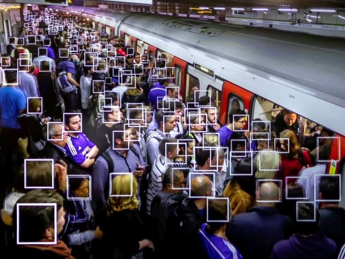

layout: true

```{r setup, include=FALSE}
options(htmltools.dir.version = FALSE)

knitr::opts_chunk$set(
	echo = FALSE,
	fig.align = "center",
	message = FALSE,
	warning = FALSE,
	cache = FALSE
)
```

```{r eval=FALSE, include=FALSE}
library(knitr)
library(tidyverse)
library(widgetframe)
```

---

class: middle, center  

```{r, out.width="50%"}
knitr::include_graphics("img/logo_MA_color.png")
```

## Laboratório de Humanidades Digitais da UFBA

**Twitter**: [@labhdufba](https://twitter.com/labhdufba) 
<br>
**Instagram**: [@labhdufba](http://instagram.com/labhdufba)
<br>
**Github**: [https://github.com/LABHDUFBA](https://github.com/LABHDUFBA)
<br>
**Youtube**: [https://www.youtube.com/c/LABHDUFBA](https://www.youtube.com/c/LABHDUFBA)


---
class: inverse, center, middle

# Aspectos gerais das sociedades digitais contemporâneas...

---
class: middle, center

## "Digitalização do eu na vida cotidiana" 

```{r, out.width="80%"}
knitr::include_graphics("img/ds.jpeg")
```
---
class: middle, center

## Algoritmização de processos sociais

```{r, out.width="60%"}
knitr::include_graphics("img/matrix-digital-self.png")
```

---
class: middle, center

## Traços digitais (digital data trace)

```{r, out.width="75%"}
knitr::include_graphics("img/socioloy.png")
```

---
class: middle, center

## Dataficação

```{r, out.width="75%"}
knitr::include_graphics("img/datafication4.jpg")
```

---
class: middle, center

## Cultura de vigilância


```{r, out.width="65%"}

```

---
class: inverse, center, middle

# qual o papel da sociologia nesse mundo digital de grandes dados continuamente produzidos?

---


---

class: middle, center

## Referências Bibliográficas

AVRITZER, Leonardo. Impasses da democracia no Brasil. Rio de Janeiro: Editora Civilização Brasileira, 2016.
<br>

CESARINO, L. 2020. Como vencer uma eleição sem sair de casa: a ascensão do populismo digital no Brasil. Internet & Sociedade, 1(1): 91-120. Disponível em: <https://revista.internetlab.org.br/serifcomo-vencer-uma-eleicao-sem-sair-de-casa-serif-a-ascensao-do-populismo-digital-no-brasil/>. Acesso em: 05/05/2020. 
<br>

NASCIMENTO, L. et al. “Não falo o que o povo quer, sou o que o povo quer”: 30 anos (1987-2017) de pautas políticas de Jair Bolsonaro nos jornais brasileiros. Plural, v. 25, n. 1, p. 135–171, 14 ago. 2018. 
<br>

WOLFSFELD, G.; SEGEV, E.; SHEAFER, T. Social Media and the Arab Spring: Politics Comes First. The International Journal of Press/Politics, v. 18, n. 2, p. 115–137, 1 abr. 2013. <br>

SANTOS, N.; SILVA, M. Midiativismo em rede: Twitter e as críticas aos meios de comunicação tradicionais em um sistema híbrido de comunicação. Esferas, p. 18, 13 ago. 2019. 
 

---
class: middle, center

## Obrigado gente!

.pull-left[
```{r, out.width="70%"}
knitr::include_graphics("https://media.giphy.com/media/JQRVMKkWAQbdiXFBkg/giphy.gif")
```
]
.pull-right[
##**Agradecimentos especiais**:
### Profa Luciene da Cruz Fernandes (UFBA/ICS) - Pelo convite!
<br>
### Ao público pela paciência!
]

